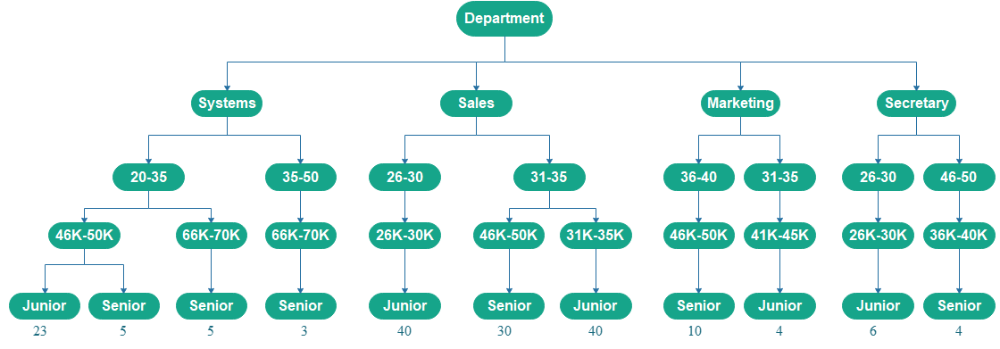
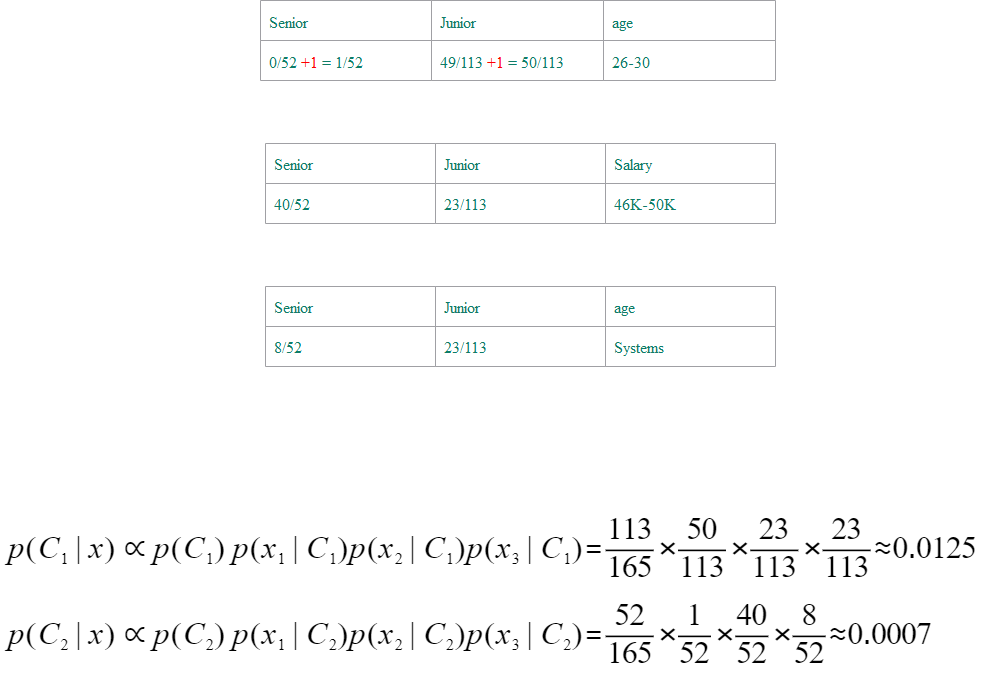

# Module 6 Assessment 2

## Complete Exercise 8.7 from ‘Chapter 8: Classification: Basic Concepts’;

### (a) How would you modify the basic decision tree algorithm to take into consideration the `count` of each generalized data tuple (i.e., of each row entry)?

#### Answer : We use count as a decision parameter for finding the class level of the employees, means how many employees are *junior* or *senior*

### (b) Use your algorithm to construct a decision tree from the given data.

#### Answer : We used status as class label attribute, categorized age in 2 ranges for simply the model then categorized salary for the last node we check the status of the employee and the count of that. the figure of the decision tree provided :
  

### (c) Given a data tuple having the values *systems*, *26...30* and *46-50K* for the given attributes *department*, *age* and *salary*, respectively, what would a naive Bayesian classification of the status for the tuple be ?

#### Now we want to determine what status this person is in. Suppose x1 equals the Department of Systems, x2 equals the age range of 26 to 30, and x3 equals a salary of $ 46-50,000. Also C1 is equivalent to junior and C2 is equivalent to senior. An approach to overcome ‘zero-frequency problem’ is to add one to the count for every attribute value-class combination when an attribute value doesn’t occur with every class value.

This will lead to the removal of all the zero values from the classes and, at the same time, will not impact the overall relative frequency of the classes.
  

#### The category categorizer will then select the C1 tag. As a result, the person with these conditions will be a junior.
